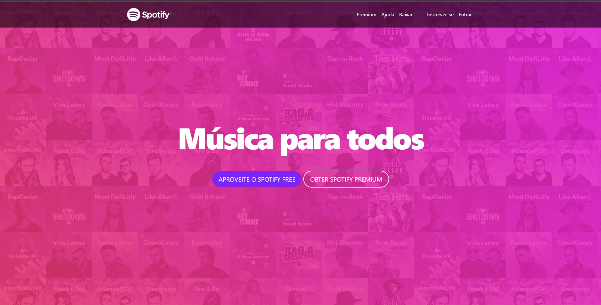

<h1 align="center"> Spotify clone </h1>

Spotify clone é um projeto didático com propósito de recriar a parte visual do site do Spotify.

 

  

## ✔ Tecnologias

Esse projeto foi desenvolvido com as seguintes tecnologias:

- HTML e CSS
- BOOTSTRAP 4
- Git e Github

## 💻 Projeto

Spotify clone é um projeto didático com propósito de recriar a parte visual do site do Spotify, iniciando com as técnologias HTML, CSS e BOOTSTRAP 4
